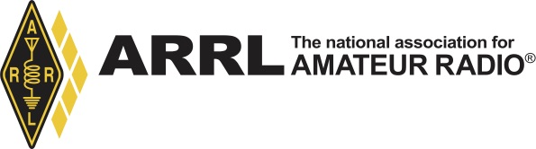
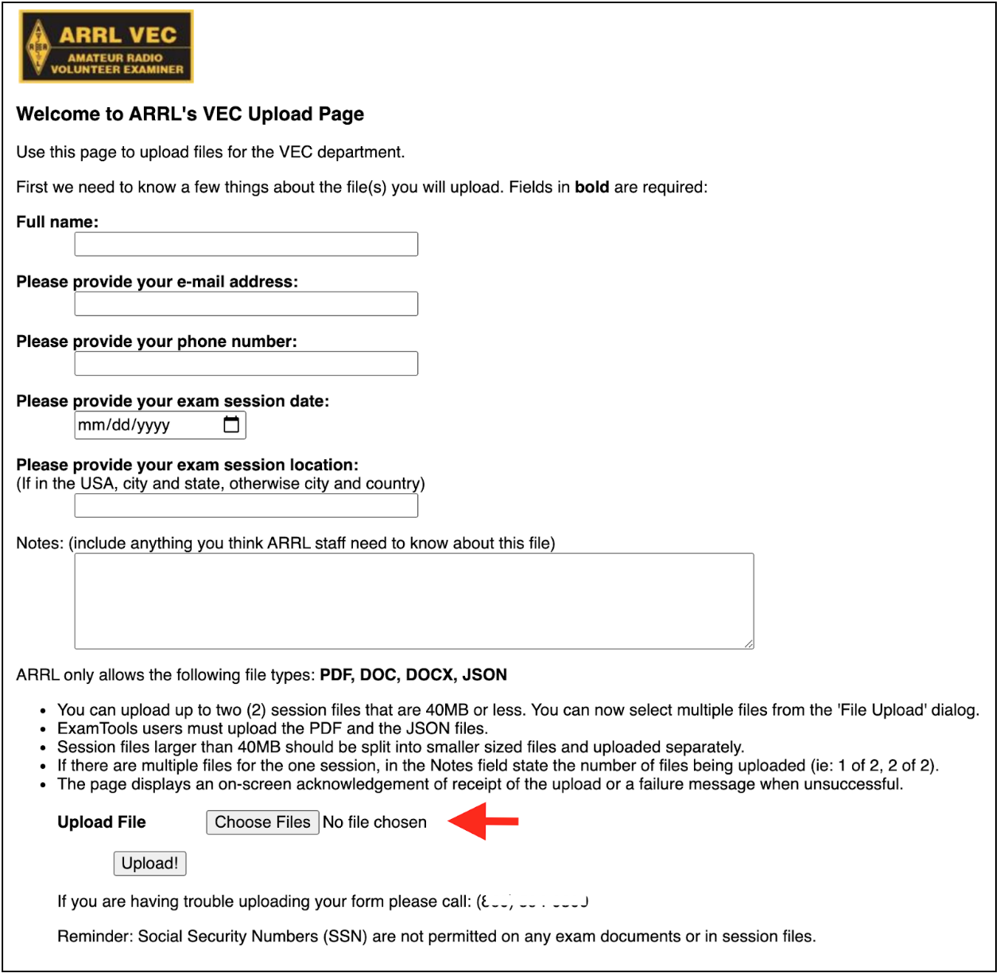

## How can a Volunteer Examiner (VE) join existing teams using ExamTools (ET)?

Go into the `#arrl` channel in [Discord]() and volunteer. Several team
leads monitor the channel and welcome new team members.  Also, check in your area for a local VE team.

## I am already using ExamTools with another VEC. How do I get added as an ARRL VE?

Active VEs are listed on http://www.arrl.org/ve-session-counts. VEs can view their accreditations in ExamTools under their Profile found in the upper left corner when logged into ExamTools. 

If not accredited, then go to http://www.arrl.org/become-an-arrl-ve to sign up. Once a VE is listed on http://www.arrl.org/ve-session-counts pages, ExamTools will sync and update the profile. Team leads will not be able to add VEs to the exam session until they have a verified ExamTools account and are accredited.

## Is there a checklist of what my VE team needs to do to get started with ExamTools?

* Team lead confirms lead status in ExamTools. If a team member needs lead status, email to VEC@arrl.org requesting permission to use ExamTools. If there is more than one lead, each VE will need to request permission. 
* Make sure all your VEs have signed up for an ExamTools Account and have verified by uploading an official copy of their current license.
* Decide on a video-platform for team training (and remote testing, if you'll be offering it). Most use Zoom.
* Familiarize your team with ExamTools by training in the sandbox which requires another account on the dev server.
* Visit remote teams, which are already skilled in the use of ExamTools. Ask to be mentored.
* Create one Team Account in ExamTools.
* Email VEC@arrl.org informing them of your team lead’s call sign (or call signs, if more than one) and your ExamTools Team Identifier (Team ID).
* Create a session for your exam. An exam session can be used for multiple candidates, even if they tested one at a time in series.
* Review the Volunteer Examiner information on the ARRL website. http://www.arrl.org/volunteer-examiners
* Set up a method of payment or you can accept cash the day of for in-person exams.
* Print exams and answer sheets, if doing in-person. 
* Purchase or borrow tablets or computers for in-person electronic exams.
 

## Is there a procedure for verifying that ARRL is good with us doing online exams?

Receipt of instructions via email from Maria is the approval for ExamTools and video-supervised sessions.
Teams can apply for permission by contacting the VEC, but be aware of these requirements before you apply:

_ARRL VE teams must meet the following criteria and adhere to the
following rules/policies to participate in the Video sessions
program. Long-standing, well established teams with a history of
adhering to the highest degree of examination integrity, and that
consistently submit accurate exam documents consistent with ARRL VEC
standards will be selected to participate._

The team should follow up with the VEC when ready to go live to
receive the confidential session document upload
instructions. However, they may be able to get
the upload instructions from their ET mentor or another trained team.

Make sure the VE Team Lead does the following:
* Has permissions from the ARRL VEC to perform the duties of the team lead for the team.
  This will result in your ExamTools profile being upgraded from VE to Team Lead (Session Manager).
* Sign up for the VE Discord chat: https://discord.gg/CsKrBmA
* Read through the ExamTools [Team Lead Documentation]() and ask questions in the Discord `#arrl` channel.
* Register in the sandbox at http://hamstudy.dev/ and then login at https://beta.examtools.dev/ with your
  team members. DO NOT use a Facebook or Google login: Make a "real" user.
  There's more info in [getting an exam.tools and sandbox account]()
* Volunteer in the Discord `#arrl` channel to help out with another team's ARRL VEC session so you get
  to see the exam process in action.

## How do I collect candidate exam fee payments?

ExamTools does not provide for any payment processing. You will need to sign up with an online payment system to accept credit cards, debit cards or payment transfers and maintain an accounting of payments collected.

Many teams use the registration confirmation email "Note to applicant" field found in the session listing to include additional info (i.e. payment information, Zoom meeting invite and other exam details) in the registration confirmation email which ExamTools sends to the applicant or may send a separate email with this information. Teams typically use online payment processors like Venmo,
PayPal, Square, Zelle, Apple Pay, Google Pay, etc.  Locate the candidate's email address
from the MANAGE dropdown `Edit Applicant` on the candidate in the session. 

## Can I get reimbursed for expenses like Zoom Pro and PayPal transaction fees?

Yes. Simply keep records of your "necessary and prudent" expenses required to run the exam session and retain up to seven dollars per applicant. You may keep all five dollars from a youth exam.
Remember the [limit](http://www.arrl.org/arrl-vec-exam-fees)
of up to seven dollars per candidate. For a monthly fee
like that of Zoom Pro, prorate it over several exam sessions if the
expense exceeds the per candidate limit for a single session. See
Retaining A Portion of the Fees on page 61 of the VE Manual for
complete rules and record-keeping requirements.


## What if a registered candidate fails to pay the fee?

It is entirely possible that some candidates will register for a
session, then will not pay nor respond to your attempts to contact them. The registration email may have gone to their spam folder.  Try calling or texting, but if you decide that you need to cancel their
registration, remove them using the MANAGE dropdown `Delete Applicant` on the candidate. This frees up the exam slot for
someone else.

## What happens when a prepaid candidate cancels or doesn't show up?

You should refund the fee if you can. This is easy to do with most
online payment systems. Also don't forget to remove them from the
ExamTools roster before submitting the test session package to the
VEC. You do this by deleting them using the MANAGE dropdown `Delete Applicant` on the candidate before
Finalizing the session. See the next question if your team policy is
to retain fees for no-shows.

## How are retained fees for pre-registered no-shows handled?

The no-show candidate fees can be listed separately in "other fees collected"
or all test fees could be added together. VE teams are
allowed to retain up to seven dollars per candidate for reasonable expenses
including the no-shows. No-show candidates whose fees are not refunded should remain on the applicant list and a note should be included
explaining the additional fee. Candidates that give the team ample
time to schedule another candidate in their vacated time slot should
be refunded. See above. See page 61 of the VE Manual for complete
rules and record-keeping requirements for retained fees.

## How do I send the exam fees to the VEC?

The team has three choices: Call and pay with credit card per session, keep a credit card on file, or mail in a check.

The VE team may keep a credit card on file with the VEC department to pay for the exam session fees. Contact
the VEC to make arrangements. Do not email your credit card information.

When sending checks for exam fees by mail, teams should please
include the test date and location and the VE team leader’s name, call
sign, and contact information for reference so ARRL can match it to the
session.

The ARRL VEC's mailing address is:

```
ARRL/VEC
225 MAIN ST
NEWINGTON CT 06111-9825
```

## Can I charge more (or less) than the fifteen dollar ARRL VEC fee?

No. The only exception is the five dollars collected for exams administered to youths.

FCC Rules require VEC organizations to agree to assure that, for any
examination, every examinee qualified under these rules is registered
without regard to race, sex, religion, national origin or membership
(or lack thereof) in any amateur service organization.

The ARRL exam fee cannot be increased, reduced, or waived; the fee is
to be applied uniformly throughout the calendar year to ensure every
candidate is treated equally and without discrimination.

The exam fee cannot be increased for a particular group of
candidates. Therefore, teams should hold back a portion of each exam fee to offset a credit card company’s payment fee. The exam fee
should be not be increased to offset the credit card fees. Additionally, teams should not accept a donation to cover the credit card fee.

## A candidate cancelled and told us to keep the fee as a donation. What do I do?

Return it.

Donations/solicitations are not allowed.

FCC Rule:  Administering VE requirements:

_§97.509 (e) No VE may administer or certify any examination by
fraudulent means or for monetary or other consideration including
reimbursement in any amount in excess of that permitted. Violation of
this provision may result in the revocation of the grant of the VE's
amateur station license and the suspension of the grant of the VE's
amateur operator license._

Soliciting, asking for donations, or offering free material to
candidates would have the appearance of impropriety.

This is to ensure the integrity of the examination process.

## Can my VE team or club solicit donations in conjunction with our VE activities?

No. (See above)

## How should I prepare my session to upload to the VEC?

Upload the VEC ARCHIVE (includes PDF of Final Forms and JSON) from ExamTools. Any [Youth Grant Reimbursement Forms](https://www.arrl.org/youth-licensing-grant-program), CSCEs, or other documentation should be selected and loaded at the same time, but not included in the VEC ARCHIVE.  Leave the VEC ARCHIVE zipped. Do *not* submit a ARRL Test Session report when using ExamTools.  Everything the VEC needs is in the VEC ARCHIVE.
 The following is a screen shot of the upload page:




## Can EBF files be uploaded to ARRL/VEC?

Instead of an EBF file, the ARRL VEC uses the JSON file, which is already included in the VEC ARCHIVE. (See above)

## Do we still have to provide FCC license copies in the uploaded package? CSCEs?

License copies are not needed. Include a copy of only
the front of any pending CSCEs. But do an [FRN lookup](https://wireless2.fcc.gov/UlsApp/UlsSearch/searchLicense.jsp) ahead of the
exam. Odds are the 605 for which the CSCE is for will already have
been acted upon by the time the exam session happens.

## How do I process a "paper upgrade" with or without an exam?

The candidate registers for the exam session and provides proof of any element credit. 
Consult the [ARRL Exam Element Credit Information](http://www.arrl.org/exam-element-credit) for what is acceptable proof.

Enter the credit(s) using the ExamTools MANAGE dropdown `Add Credit` for the candidate. In the case of expired Amateur Extra, make sure to give both Element 3 and Element 4 credit.

* If the candidate has no current license they need to take the Element 2 exam. Upon passing, the candidate does the usual signature process.

* If the candidate already has a current license and thus is not taking an actual exam, change the candidate Status from `registered` or `seen` to `ready to sign`. The candidate logs into the session using the team identifier and their pin and is presented with the usual signature process.

After the three assigned VEs and the candidate have all signed, the candidate is Marked Complete and ExamTools generates the proper forms reflecting these credits.

Submit the proof documents for the candidate together with the VEC ARCHIVE at the end of the session.

## What do we sign when a candidate fails? How do we prove the failed exam happened?

There is nothing to sign. Proof of failure is displayed in the Applicant List and the session manifest. The candidate's results sheet showing a failing score is included in the VEC ARCHIVE.

In traditional in-person exams, the candidate usually fills out the
[NCVEC QUICK-FORM 605 APPLICATION](https://www.arrl.org/files/file/VEs/NCVEC_Form_605_July_2022_INTERACTIVE.pdf) in advance of the exam in order to streamline the process at the
end of the session and so the VEs can confirm candidate identity
matches their photo ID. In that case, it is common practice to either
return the unsigned 605 to the candidate [per 97.509(i)] or to send it
to the VEC, possibly signed but with the NO NEW LICENSE OR UPGRADE WAS
EARNED box checked.

However, it is acceptable for a candidate to only fill out
their 605 after successful completion of the exam element(s) and then
the VEs sign it and send it to the VEC [97.509(l)].

ExamTools implements this practice by not generating a 605 (and CSCE)
until after the candidate's new license or upgrade is earned and the
candidate is Finalized. The information typically found on the 605
and/or candidate roster for traditional exam sessions is collected at
the point of candidate registration in Hamstudy.org
[97.17(b)(1): "...The VEs may collect all necessary information
in any manner of their choosing, including creating their own forms."]

## Can answers be provided to candidates?

Yes, answers can be shared from all online ExamTools exams which are
randomly generated; examinees won't be retested with the exact
same question set. However, do not provide answers to reusable
in-person exams that are scored with blue overlay grading templates.

## Where do I find the ARRL forms, exam booklets and blank answer sheets which work with the blue overlay templates?

ExamTools only provides the exams keyed to the templates.  Everything else comes from the ARRL VEC. Check out https://www.arrl.org/resources-for-ves and email the ARRL VEC for anything else you might need for your session. 

Teams using GradeCam will only need to print GradeCam exams and bubble answer sheets. ExamTools takes care of all the paperwork. Teams submit the VEC ARCHIVE to the portal when done.  That is it!

## How do we get our sessions listed on the HamStudy website?  We aren't doing online exams.

Create a session in ExamTools and adjust the setting to allow for online registration or not.  It is up to the team.  They don't have to use it for testing, but can use it for registration or to create a listing where candidates contact the team directly to sign up.

## How long does it take for the ARRL VEC to process my uploaded session and for my candidates to get their licenses?

It may take two to three days. Sometimes longer, if there are problems at the FCC. ExamTools sessions are often processed on the first business day following a submission.  Candidates (new licensees only) may pay their thirty-five dollar application fee by logging into CORES once they have a pending application with the FCC.  They can not pay before then. Candidates should use a computer and not a cell phone or tablet to pay.  There is a history of problems with payments made on mobile devices. If they pay before 6pm Eastern, they most likely will receive their callsign over night. The candidate must pay within ten calendar days of their application being processed at the FCC.  If they do not, the application will be dismissed and the candidate will have to ask the VEC for the application to be resubmitted. They should expect two emails from the FCC.  The first one requests payment linking to CORES and the other includes the new license when granted or upgraded. Candidates who do not get these emails need to still log into CORES to pay and should not wait more than a few days.  Then, into the License Manager to export a copy of their official license.  Candidates who are upgrading do not have to pay an application fee to the FCC.  Their applications are usually processed all the way through when received at the FCC and typically should see their upgrades within a hour.

