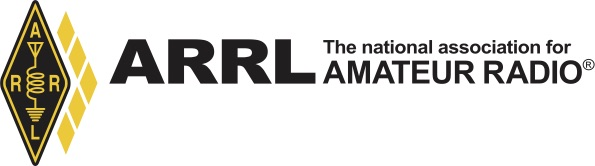
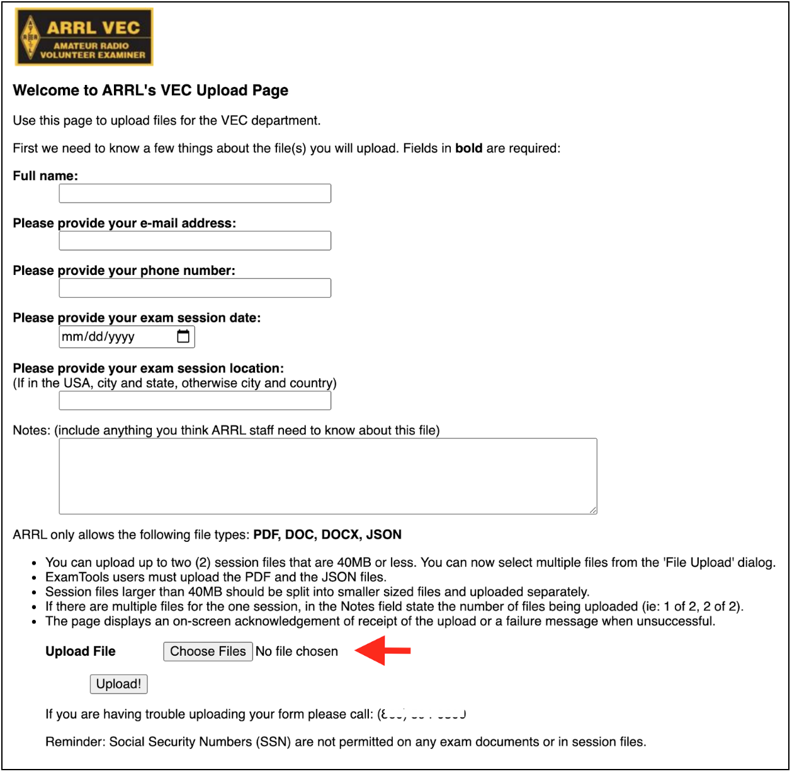
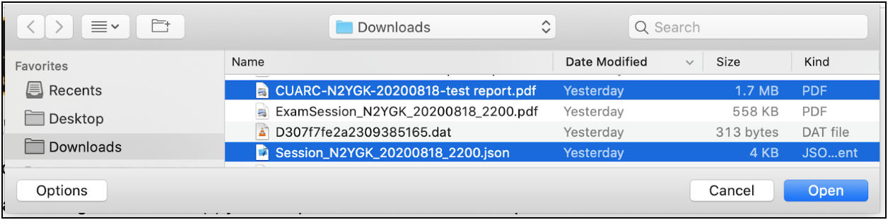

## Can a VE volunteer join existing teams performing remote exams?

Yes. Go into the `#arrl` channel in Discord and volunteer. Several team
leads monitor the channel and will get in touch, especially if they
are short-handed.

## I am already an ExamTools VE with another VEC. How do I get added as an ARRL VE?

First, make sure you are accredited with the ARRL/VEC and confirm that
you are listed at http://www.arrl.org/ve-session-counts for your
state. Once you've done that, notify your ARRL VE Team Liaison (CVE)
who will ask that your ARRL/VEC affiliation be added to your ExamTools
profile. If you are already in Discord, you can send a message to
`@Experienced Support` in the `#examtools-requests` channel requesting
that they add you as an ARRL VE. If you are not in Discord, ask your
VE Team Liaison to do it for you.


## Is there a checklist of what my VE team needs to do?

See [this checklist]()
used by the [Columbia University ARC VE Team](https://www.w2aee.columbia.edu/video-exams)
for some ideas. As with in-person sessions, there's always room for customizing how your particular team operates.

## Is there a procedure for verifying that ARRL is good with us doing online exams?
Receipt of instructions via email from Maria is the approval for ExamTools and video sessions. 
You must apply for permission by contacting the VEC but be aware of these requirements before you apply:

_ARRL VE teams must meet the following criteria and adhere to the
following rules/policies to participate in the Video sessions
program. Long-standing, well established teams with a history of
adhering to the highest degree of examination integrity, and that
consistently submit accurate exam documents consistent with ARRL VEC
standards will be selected to participate._

The team should follow up with the VEC when ready to go live to
receive the confidential session document upload
instructions. However, if they have been training and are able to get
the upload instructions from a trained team, that would be acceptable.

Make sure you, the CVE (VE Team Liaison), do the following:
* Follow the instructions in Maria's email.
* Sign up for the VE Discord chat here: https://discord.gg/CsKrBmA
* Upgrade your VE Discord membership by filling out [this form](https://docs.google.com/forms/d/e/1FAIpQLSfx_3ZzX_Yc0ABnRlnTShIXIMeigeFSLzUEN20bOjGnIUhOAA/viewform).
  * To answer this question: "Please provide a link to some form of evidence to verify your VE credentials:" 
    put in the link to the ARRL VE Counts page for your state. 
    For example: http://www.arrl.org/ve-session-counts?state=CA
    (If your call sign is not on the page for your state, you will need to resolve your VE accreditation
    with the VEC.)
* Read through the entire #process-tips channel in Discord.
* Register in the sandbox at http://hamstudy.dev/ and then login at https://beta.examtools.dev/ with your
  team members. DO NOT use a Facebook or Google login: Make a "real" user. 
  There's more info in Discord #process-tips.
* Volunteer in the Discord #arrl channel to help out with another team's ARRL/VEC session so you get
  to see the real system in action.
* Once ready, you and all your VEs must register for tier 2 production via [this form](https://forms.gle/cD9fTqv5ognik6XC9).
* Forward your approval email from the ARRL/VEC to verifications@examtools.org 
  making sure to note your call sign, username and email address.
  This will result in your Examtools membership being upgraded from VE to CVE (liaison).

## How do I collect candidate exam fee payments?

At this time, Examtools does not provide for any payment
processing. You will need to establish a mechanism for requesting and
collecting payments and keeping track of who has paid – preferably
before or during the exam session – and sending payment to the VEC as
appropriate.

Many teams send email to registered candidates to request payment and
other details as needed (e.g. how many elements they intend to take)
and typically use online personal payment processors like Venmo,
PayPal, Zelle, Apple Pay, Google Pay, etc. or even have candidates
mail them personal checks! You can get the candidate's email address
from the Session Old Manifest: Click on the candidate's name to see
details.


## Can I get reimbursed for expenses like Zoom Pro and PayPal transaction fees?

Yes. Simply keep records of your "necessary and prudent" expenses
required to run the exam session and submit for reimbursement,
remembering the [limit](http://www.arrl.org/arrl-vec-exam-fees)
of up to \$7 per candidate. For a monthly fee
like that of Zoom Pro, prorate it over several exam sessions if the
expense exceeds the per candidate limit for a single session. See
Retaining A Portion of the Fees on page 61 of the VE Manual for
complete rules and record-keeping requirements.


## What if a registered candidate fails to pay the fee?

It is entirely possible that some candidates will register for a
session and not respond to the email that you sent requesting
payment. It's unclear if this is due to your mail going into their
spam folder or they are just plain rude. You can cancel their
registration by deleting them from the Session Old Manifest by
clicking on the trash can icon. This frees up the exam slot for
someone else.

## What happens when a prepaid candidate cancels or doesn't show up?

You should refund the fee if you can. This is easy to do with most
online payment systems. Also don't forget to remove them from the
Examtools roster before submitting the test session package to the
VEC. You do this by deleting them from the Old Manifest prior to
Finalizing the session. See the next question if your team policy is
to retain fees for no-shows:

## How are retained fees for pre-registered no-shows handled?

The no-show candidate fees can be listed separately in "other fees collected"
or all test fees could be added together. VE teams are
allowed to retain up to \$7 per candidate for reasonable expenses
including the no-shows. No-show candidates that are not refunded the
test fee could be listed on the roster or a note should be included
explaining the additional fee. Candidates that give the team ample
time to schedule another candidate in their vacated time slot should
be refunded. See above. See page 61 of the VE Manual for complete
rules and record-keeping requirements for retained fees.

## How do I send the exam fees to the VEC?

When sending/mailing the exam fees checks, we ask that teams please
include the test date and location and the VE team leader’s name, call
sign, and contact information for reference so we can match it to the
session.

The ARRL/VEC's mailing address is:

```
ARRL/VEC
225 MAIN ST
NEWINGTON CT 06111-9825
```

Instead of mailing a check(s), the VE team may keep a credit card on
file with the VEC department to pay for the exam session fees. Contact
the VEC to make arrangements. Do not email your credit card
information.

## Can I charge more (or less) than the \$15 ARRL/VEC fee?

No.

FCC Rules require VEC organizations to agree to assure that, for any
examination, every examinee qualified under these rules is registered
without regard to race, sex, religion, national origin or membership
(or lack thereof) in any amateur service organization.

The ARRL exam fee cannot be increased, reduced, or waived; the fee is
to be applied uniformly throughout the calendar year to ensure every
applicant is treated equally and without discrimination.

The exam fee cannot be increased for a particular group of
applicants. Therefore, teams should hold back a portion of each \$15
exam fee to offset a credit card company’s payment fee. The exam fee
should be not increased to offset the credit card fees.

## A candidate cancels and says "keep the fee as a donation". What do I do?

Return it.

Donations/solicitations are not allowed.

FCC Rule:  Administering VE requirements:

_§97.509 (e) No VE may administer or certify any examination by
fraudulent means or for monetary or other consideration including
reimbursement in any amount in excess of that permitted. Violation of
this provision may result in the revocation of the grant of the VE's
amateur station license and the suspension of the grant of the VE's
amateur operator license._

Soliciting, asking for donations, or offering free material to
candidates would have the appearance of impropriety.

This is to ensure the integrity of the examination process.

## Can my VE team or club solicit donations in conjunction with our VE activities?

No. See above.

## How should I prepare my session to upload to the VEC?

Once you receive the confidential uploading documentation, you will
need to upload two files. Do this once by selecting the two from your
browser's upload dialog: Build a single PDF file that contains the
entire session. See this [this example checklist]() used by the Columbia
University ARC VE Team that seems to be acceptable (and might be
overkill).

Export your exam session JSON document and upload that as
well. This document will eventually help the VEC automate a bunch of
currently manual data entry.  See the following screenshots for an
example:






## Can EBF files be uploaded to ARRL/VEC?

Instead of an EBF file, you should upload the exported session JSON
file along with the session report PDF. As described above.

## Do we still have to provide FCC license copies in the uploaded package? CSCEs?

License copies are not needed. You do need to include a copy of only
the front of any pending CSCEs. But do an [FRN lookup](https://wireless2.fcc.gov/UlsApp/UlsSearch/searchLicense.jsp) ahead of the
exam. Odds are the 605 for which the CSCE is for will already have
been acted upon by the time the exam session happens.

## How do I process a "paper upgrade" with no exam (Examtools doesn't support this)?

Have the candidate fill out
[this fillable 605](http://www.arrl.org/files/file/VEs/605%20Form_2020_Remote_Fully%20Interactive.pdf)
ahead of time.

We don’t need the VEs signatures on the form (to make it easier for
the team) if the team members email us this statement as the
signatures:

“I CERTIFY THAT I HAVE COMPLIED WITH THE ADMINISTERING VE REQUIREMENTS
IN PART 97 OF THE COMMISSION’S RULES AND WITH THE INSTRUCTIONS
PROVIDED BY THE COORDINATING VEC AND THE FCC FOR EXAM SESSION (DATE
and LOCATION).”  By typing your name below, you are signing this form
electronically. Understand that your electronic signature is legally
binding, as if you had physically signed the document by hand.

The CSCE can be filled in ahead of time by the team and then emailed to the candidate. 

## What do we sign when a candidate fails? How do we prove the failed exam happened?

There is nothing to sign. Proof of failure is that Print Session
Forms/Final Forms contains the candidate roster showing failed
element(s) and the candidate's answer sheet showing a failing
score. Your ARRL Test Session report also has a place to count
candidates who did not earn a new license or upgrade.

In traditional in-person exams, the candidate usually fills out the
605 in advance of the exam in order to streamline the process at the
end of the session and so the VEs can confirm candidate identity
matches their photo ID. In that case, it is common practice to either
return the unsigned 605 to the candidate [per 97.509(i)] or to send it
to the VEC, possibly signed but with the NO NEW LICENSE OR UPGRADE WAS
EARNED box checked.

However, it is acceptable [citation?] for a candidate to only fill out
their 605 after successful completion of the exam element(s) and then
the VEs sign it and send it to the VEC [97.509(l)].

Examtools implements this practice by not generating a 605 (and CSCE)
until after the candidate's new license or upgrade is earned and the
candidate is Finalized. The information typically found on the 605
and/or candidate roster for traditional exam sessions is collected at
the point of candidate registration in Hamstudy.org
[97.17(b)(1): "...The VEs may collect all necessary information
in any manner of their choosing, including creating their own forms."]

If you want to return an unsigned 605 with NO NEW LICENSE OR UPGRADE
WAS EARNED box checked in the VEC package, use Print Session Forms/All
Forms. But the 605 will not be signed by the candidate or VEs and the
session manifest is not included, so you'll have to do some "PDF
splicing".

## Can answers be provided to candidates?

Yes for randomly-generated exams like ExamTools prepares but not for
in-person exams using ARRL/VEC pre-printed exam booklets.  For the
online exam setting we can be more flexible because all exams are
randomly generated and examinees wouldn’t be retested with the exact
same question set.

Moving forward, ARRL will allow candidates to be given their answer
sheets for randomly generated tests, if the team chooses. This would
apply to online as well as in-person sessions when randomly generated
examinations are used.
