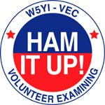

## Can a VE volunteer join existing teams performing remote exams?

Yes. Go into the `#W5YI` channel in Discord and volunteer. Several team
leads monitor the channel and will get in touch, especially if they
are short-handed.

## I am already an ExamTools VE with another VEC. How do I get added as an W5YI VE?

First, make sure you are accredited with the W5YI/VEC.
If you do not already have W5YI credentials, contact a sponsering CVE and submit VE application to vec@w5yi.org  

Once you have your W5YI Credentials, you must have your W5YI credentials added to your profile.
Follow [this link](https://docs.google.com/forms/d/e/1FAIpQLScoAQdcplRzCg-4TRPbhRTzMoskHpeKvk4hiaRk1MIYFQWJ_Q/viewform) 
and fill out and submit the form to notify @Experienced Support 
of the additional VEC accreditation.  When filling out the form, you can 
simply write “Adding VE Credentials” in the field for the Request ID.  

Your team lead will be able to add you to their Exam Tools session once 
@Experienced Support has received the file and updated your profile.


## Is there a checklist of what my VE team needs to do?

See [this checklist]()
used by the [AA7HW VE Team](https://aa7hw.org/) for some ideas. As with in-person sessions, there's always room for customizing how your particular team operates.

## Is there a procedure for verifying that W5YI is good with us doing online exams?

You must apply for permission by contacting the VEC but be aware of these requirements before you apply:

_W5YI VE teams must meet the following criteria and adhere to the
following rules/policies to participate in the Video sessions
program. Long-standing, well established teams with a history of
adhering to the highest degree of examination integrity, and that
consistently submit accurate exam documents consistent with W5YI VEC
standards will be selected to participate._

The team should follow up with the VEC when ready to go live to
receive the confidential session document upload
instructions. However, if they have been training and are able to get
the upload instructions from a trained team, that would be acceptable.

Make sure you, the CVE (VE Team Liaison), do the following:

* Read through exam.tools [CVE documentation](), if you have questions you can ask them in the Discord `#W5YI` channel.
* Register in the sandbox at http://hamstudy.dev/ and then login at https://beta.examtools.dev/ with your
  team members. DO NOT use a Facebook or Google login: Make a "real" user.
  There's more info in [getting an exam.tools and sandbox account]()
* Volunteer in the Discord `#W5YI` channel to help out with another team's W5YI/VEC session so you get
  to see the real system in action.


## How do I collect candidate exam fee payments?

At this time, Examtools does not provide for any payment
processing. You will need to establish a mechanism for requesting and
collecting payments and keeping track of who has paid – preferably
before or during the exam session – and sending payment to the VEC as
appropriate.

Many teams send email to registered candidates to request payment and
other details as needed (e.g. how many elements they intend to take)
and typically use online personal payment processors like Venmo,
PayPal, Zelle, Apple Pay, Google Pay, etc. or even have candidates
mail them personal checks! You can get the candidate's email address
from the MANAGE dropdown `Edit Applicant` on the candidate in your session.


## What if a registered candidate fails to pay the fee?

It is entirely possible that some candidates will register for a
session and not respond to the email that you sent requesting
payment. It's unclear if this is due to your mail going into their
spam folder or they are just plain rude. You can cancel their
registration by deleting them using the MANAGE dropdown `Delete Applicant` on the candidate. This frees up the exam slot for
someone else.

## What happens when a prepaid candidate cancels or doesn't show up?

You should refund the fee if you can. This is easy to do with most
online payment systems. Also don't forget to remove them from the
Examtools roster before submitting the test session package to the
VEC. You do this by deleting them using the MANAGE dropdown `Delete Applicant` on the candidate before
Finalizing the session. See the next question if your team policy is
to retain fees for no-shows:

## How are retained fees for pre-registered no-shows handled?

VE teams are allowed to retain up to \$7 per candidate for reasonable expenses
including the no-shows. No-show candidates that are not refunded the
test fee could be listed on the roster or a note should be included
explaining the additional fee. Candidates that give the team ample
time to schedule another candidate in their vacated time slot should
be refunded. See above. See the VE Manual for complete
rules for retained fees.

## How do I send the exam fees to the VEC?

When sending/mailing the exam fees checks, we ask that teams please
include the test date and location and the VE team leader’s name, call
sign, and contact information for reference so we can match it to the
session.

The W5YI/VEC's mailing address is:

```
W5YI/VEC
POB 200065
Arlington, Texas 76006-0065
```

Instead of mailing a check(s), the VE team may keep a credit card on
file with the VEC department to pay for the exam session fees. Contact
the VEC to make arrangements. Do not email your credit card
information.

## Can I charge more (or less) than the \$14 W5YI/VEC fee?

No.

FCC Rules require VEC organizations to agree to assure that, for any
examination, every examinee qualified under these rules is registered
without regard to race, sex, religion, national origin or membership
(or lack thereof) in any amateur service organization.

The W5YI exam fee cannot be increased, reduced, or waived; the fee is
to be applied uniformly throughout the calendar year to ensure every
applicant is treated equally and without discrimination.

The exam fee cannot be increased for a particular group of
applicants. Therefore, teams should hold back a portion of each \$14
exam fee to offset a credit card company’s payment fee. The exam fee
should be not increased to offset the credit card fees.


## Can my VE team or club solicit donations in conjunction with our VE activities?

FCC Rule:  Administering VE requirements:

_§97.509 (e) No VE may administer or certify any examination by
fraudulent means or for monetary or other consideration including
reimbursement in any amount in excess of that permitted. Violation of
this provision may result in the revocation of the grant of the VE's
amateur station license and the suspension of the grant of the VE's
amateur operator license._

Soliciting, asking for donations, or offering free material to
candidates would have the appearance of impropriety.

This is to ensure the integrity of the examination process.

## How should I prepare my session to upload to the VEC?

Once you receive the confidential uploading documentation, you will
need to upload two files. Do this once by selecting the two from your
browser's upload dialog: 

Download a PDF of the FInal DOcuments from Exam.tools

Export your exam session W5YI .dat document and upload that as
well. This document will allow the VEC to import your session info.


## Can EBF files be uploaded to W5YI/VEC?

No. you should upload the exported session W5yi .dat 
file along with the session report PDF. As described above.

## Do we still have to provide FCC license copies in the uploaded package? CSCEs?

License copies are not needed. You do need to include a copy of only
the front of any pending CSCEs. But do an [FRN lookup](https://wireless2.fcc.gov/UlsApp/UlsSearch/searchLicense.jsp) ahead of the
exam. Odds are the 605 for which the CSCE is for will already have
been acted upon by the time the exam session happens.

## How do I process a "paper upgrade" with or without an exam?

The candidate registers for your exam session and provides proof to you of any element credit. 
Consult the W5YI VE manual for what is acceptable proof.

You will enter the credit(s) using the exam.tools MANAGE dropdown `Add Credit` for the candidate. Make sure you handle the case of expired Amateur Extra by giving both Element 3 and Element 4 credit.

* If the candidate has no current license they need to take the Element 2 exam. Upon passing, the candidate does the usual signature process.

* If the candidate already has a current license and thus is not taking an actual exam, you need to move the candidate Status from `registered` or `seen` to `ready to sign`. The candidate logs into the session using their pin and is presented with the usual signature process.

After the 3 VEs assigned to the candidate have signed and the candidate is marked complete, exam.tools generates the proper forms reflecting these credits.


## What do we sign when a candidate fails? How do we prove the failed exam happened?

You must sing the 605 as Proof of failure.  The Print Session
Forms/Final Forms contains the candidate roster showing failed
element(s) and the candidate's answer sheet showing a failing
score. Your W5YI Test Session report also has a place to count
candidates who did not earn a new license or upgrade.

In traditional in-person exams, the candidate usually fills out the
605 in advance of the exam in order to streamline the process at the
end of the session and so the VEs can confirm candidate identity
matches their photo ID. In that case, it is common practice to either
return the unsigned 605 to the candidate [per 97.509(i)] or to send it
to the VEC, possibly signed but with the NO NEW LICENSE OR UPGRADE WAS
EARNED box checked.

However, it is acceptable [citation?] for a candidate to only fill out
their 605 after successful completion of the exam element(s) and then
the VEs sign it and send it to the VEC [97.509(l)].

Examtools implements this practice by not generating a 605 (and CSCE)
until after the candidate's new license or upgrade is earned and the
candidate is Finalized. The information typically found on the 605
and/or candidate roster for traditional exam sessions is collected at
the point of candidate registration in Hamstudy.org
[97.17(b)(1): "...The VEs may collect all necessary information
in any manner of their choosing, including creating their own forms."]

If you want to return an unsigned 605 with NO NEW LICENSE OR UPGRADE
WAS EARNED box checked in the VEC package, use Print Session Forms/All
Forms. But the 605 will not be signed by the candidate.


