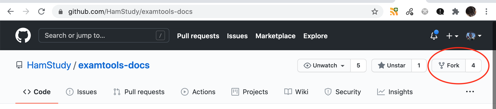

# Instructions for Contributors and Maintainers

Here's a checklist for Contributors and Maintainers, using [Github workflow](https://guides.github.com/introduction/flow/).
The examples all assume you've [added a github ssh key](https://docs.github.com/en/free-pro-team@latest/github/authenticating-to-github/adding-a-new-ssh-key-to-your-github-account).

<!-- install markdown-toc: `npm install -g markdown-toc` -->
<!-- run `markdown-toc -i maintainer.md` to update this ToC -->

<!-- toc -->

- [Contributors and Maintainers Defined](#contributors-and-maintainers-defined)
- [Fork the repo](#fork-the-repo)
- [Add a ref to the upstream repo](#add-a-ref-to-the-upstream-repo)
- [Make a feature branch](#make-a-feature-branch)
- [Make your changes](#make-your-changes)
- [Test your changes](#test-your-changes)
- [Commit your changes and push to your repo](#commit-your-changes-and-push-to-your-repo)
- [Submit a Pull Request](#submit-a-pull-request)
- [Alternative approach: Editing in the browser on GithHub](#alternative-approach-editing-in-the-browser-on-githhub)
- [Maintainer Only: Review and Merge Pull Request](#maintainer-only-review-and-merge-pull-request)
- [Maintainer Only: Publish](#maintainer-only-publish)

<!-- tocstop -->

## Contributors and Maintainers Defined

Anybody can be a *Contributor*. Follow the next steps to fork the repo, make a feature branch and submit a pull request (PR).

*Maintainers* have permissions to review and merge PRs into the master branch and to publish to the release branch.

## Fork the repo

If you are new to maintaining the docs, perform this one-time task:

Fork your own copy of the repo. In the examples below, I call it `my-repo`.

Go to https://github.com/HamStudy/examtools-docs and click Fork.



Once you've forked it, you can clone it locally to your desktop, following the instructions provided.

```text
$ git clone git@github.com:myname/examtools-docs.git my-repo
$ cd my-repo
```

Your clone of the repo will have the default remote name of `origin`.

```text
$ git remote -v
origin	git@github.com:myname/examtools-docs.git (fetch)
origin	git@github.com:myname/examtools-docs.git (push)
```

## Add a ref to the upstream repo

Add a reference to upstream so you can keep your fork in sync.

```text
$ git remote add upstream git@github.com:HamStudy/examtools-docs.git
$ git remote -v
origin	git@github.com:myname/examtools-docs.git (fetch)
origin	git@github.com:myname/examtools-docs.git (push)
upstream	git@github.com:HamStudy/examtools-docs.git (fetch)
upstream	git@github.com:HamStudy/examtools-docs.git (push)
```

Any time you want to get up-to-date with the latest changes, `git pull upstream master`:

```text
$ git checkout master
$ git pull upstream master
remote: Enumerating objects: 1, done.
remote: Counting objects: 100% (1/1), done.
remote: Total 1 (delta 0), reused 0 (delta 0), pack-reused 0
Unpacking objects: 100% (1/1), done.
From github.com:HamStudy/examtools-docs
 * branch            master     -> FETCH_HEAD
   03a0672..fca28f5  master     -> upstream/master
Updating 03a0672..fca28f5
Fast-forward
 content/docs/cve/_index.md | 2 --
 1 file changed, 2 deletions(-)
```

To keep your fork of the repo current, you can push to it (note that the first time you use this shortcut flavor
of `git push` you'll be prompted to do a longer command: `git push --set-upstream origin master`.
From then on just `git push` pushes to your repo).

```text
$ git push
Total 0 (delta 0), reused 0 (delta 0)
To github.com:myname/examtools-docs.git
   03a0672..fca28f5  master -> master
```

## Make a feature branch

Now that your fork is current with the master branch, make a new feature branch to hold your changes.

```text
$ git checkout -b my_feature
Switched to a new branch 'my_feature'
```

## Make your changes

The web site content is in the `content` directory tree.

Do some editing of the content files as needed. For example, I want to make some changes to the ARRL CVE checklist:

```text
$ emacs content/docs/cve/arrl/checklist.md
```

## Test your changes

One time: See the [instructions](https://wowchemy.com/docs/install-locally/) for installing Hugo locally.

For example, on a Mac with homebrew.
```
brew install git golang hugo
```

Then run the Hugo server to view your newly updated site:

```text
$ hugo server
hugo: downloading modules …
hugo: collected modules in 2778 ms

                   | EN  
-------------------+-----
  Pages            | 31  
  Paginator pages  |  0  
  Non-page files   |  8  
  Static files     |  5  
  Processed images | 19  
  Aliases          |  4  
  Sitemaps         |  1  
  Cleaned          |  0  

Built in 292 ms
Watching for changes in /Users/myuser/my-repo/{assets,content,data,static}
Watching for config changes in /Users/myuser/my-repo/config/_default, /Users/myuser/my-repo/go.mod
Environment: "development"
Serving pages from memory
Running in Fast Render Mode. For full rebuilds on change: hugo server --disableFastRender
Web Server is available at //localhost:1313/ (bind address 127.0.0.1)
Press Ctrl+C to stop
```

And open http://localhost:1313/ in your browser.

Rinse and repeat until your changes look right.

You can also run `./view.sh ` which does `hugo server --disableFastRender --i18n-warnings -p 1316`.


## Commit your changes and push to your repo

```text
$ git status
On branch my_feature
Changes not staged for commit:
  (use "git add <file>..." to update what will be committed)
  (use "git restore <file>..." to discard changes in working directory)
	modified:   _index.md

no changes added to commit (use "git add" and/or "git commit -a")
$ git add _index.md 
$ git commit -m 'a useful short description here'
[my_feature 7701f9c] a useful short description here
 1 file changed, 37 insertions(+), 34 deletions(-)
$ git push
fatal: The current branch my_feature has no upstream branch.
To push the current branch and set the remote as upstream, use

    git push --set-upstream origin my_feature
$ git push --set-upstream origin my_feature
Enumerating objects: 13, done.
Counting objects: 100% (13/13), done.
Delta compression using up to 8 threads
Compressing objects: 100% (6/6), done.
Writing objects: 100% (7/7), 1.82 KiB | 1.82 MiB/s, done.
Total 7 (delta 3), reused 0 (delta 0)
remote: Resolving deltas: 100% (3/3), completed with 3 local objects.
To github.com:myname/examtools-docs.git
   700e65d..7701f9c  my_feature -> my_feature
Enumerating objects: 11, done.
Counting objects: 100% (11/11), done.
Delta compression using up to 8 threads
Compressing objects: 100% (6/6), done.
Writing objects: 100% (6/6), 1.30 KiB | 1.30 MiB/s, done.
Total 6 (delta 2), reused 0 (delta 0)
remote: Resolving deltas: 100% (2/2), completed with 2 local objects.
remote: 
remote: Create a pull request for 'my_feature' on GitHub by visiting:
remote:      https://github.com/myname/examtools-docs/pull/new/my_feature
remote: 
To github.com:myname/examtools-docs.git
 * [new branch]      my_feature -> my_feature
Branch 'my_feature' set up to track remote branch 'my_feature' from 'origin'.
```

## Submit a Pull Request

Now go to the above URL in your browser and you can submit a PR.

## Alternative approach: Editing in the browser on GithHub

You can also edit pages directly in the web browser on github.com. When ready to save your edit, in the Commit Changes
box at the bottom of the page, select "Create a **new branch** for this commit and start a pull request" rather than
the default to "Commit directly to the `master` branch."  Choose a descriptive name for your update or just let
GitHub pick a boring one like "_user_-patch-1."

The main drawback of this approach is you can't test your updates locally via Hugo, but this is way simpler!


## Maintainer Only: Review and Merge Pull Request

As a maintainer you can review the PR, request changes, approve, etc. and then merge it to master.

## Maintainer Only: Publish

Publishing to https://docs.exam.tools/ only happens when you push the `master` to the `release` branch.

```text
cd my-repo
git checkout master
git pull upstream master
git push upstream master:release
```
